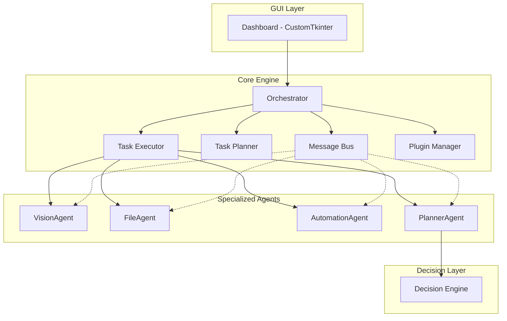

# ⚡ ShadowForge v2.1

**A fully local, offline Multi-Agent Desktop Automation System**

### What's New in v2.1
- **Screen Monitor** — interval capture (1/2/3/5/10 sec) while executor runs
- **Folder Scanner** — scan ANY folder with Browse button; fresh results every time (bug fixed)
- **Quick Actions** — reliable one-click automations (Win+D, Ctrl+S, Screenshot, Alt+Tab, etc.)
- **EasyOCR + Tesseract** — dual OCR engines
- **Clean desktop launcher** — double-click `ShadowForge.lnk` or `RUN_SHADOWFORGE.bat`

ShadowForge is a modular, extensible multi-agent system that observes your desktop, understands context, plans tasks, and autonomously executes automation workflows — with **zero external API or internet dependency**.

Built for the Kaggle 5-Day AI Agents Vibe Coding Capstone.

---

## Downloaded the ZIP? Start Here

If you downloaded this project as a ZIP from GitHub (not `git clone`), follow these steps:

1. **Extract the ZIP** — you will get a folder named `ShadowForge-main` or `ShadowForge`.
2. **Open that folder** — inside you will find `main.py`, `INSTALL_AND_RUN.bat`, and `START_HERE.txt`.
3. **Install Python 3.10+** from [python.org](https://www.python.org/downloads/) if you do not have it. Check **"Add Python to PATH"** during install.
4. **Double-click `INSTALL_AND_RUN.bat`** — this installs dependencies and launches the app (first run takes 1–2 minutes).
5. **Next time**, double-click `RUN_SHADOWFORGE.bat` to open the app instantly.

> **There is no `.exe` file.** The app runs via `main.py` (Python). The `.bat` files above run it for you automatically.

**Where screenshots are saved on your PC:** `data/screenshots/` inside the project folder (created automatically on first run).

See `START_HERE.txt` in the project root for quick instructions, or **`USER_MANUAL.md`** for the complete professional user guide.

---

## Features

- **Multi-Agent Architecture** — Vision, File, Automation, and Planner agents coordinated by an Orchestrator
- **Screen Understanding** — OpenCV + Tesseract OCR for screen capture and text extraction
- **File Automation** — Smart organization, duplicate detection, empty folder cleanup
- **UI Automation** — Mouse/keyboard control via PyAutoGUI
- **Rule-Based Intelligence** — Keyword-scoring decision engine (no LLM required)
- **Plugin System** — Drop in new agents without touching core code
- **Beautiful Dashboard** — CustomTkinter dark-mode GUI with live task monitoring
- **Full Audit Trail** — Logging and persistent action history

---

## Architecture



### Agent Responsibilities

| Agent | Role |
|-------|------|
| **VisionAgent** | Screen capture, OCR, UI element detection |
| **FileAgent** | Directory scanning, duplicate detection, file organization |
| **AutomationAgent** | Mouse clicks, keyboard input, hotkeys |
| **PlannerAgent** | Goal analysis, workflow selection, task routing |
| **Orchestrator** | Registers agents, manages queue, coordinates execution |

---

## Project Structure

```
ShadowForge/
├── main.py                  # Application entry point
├── config.json              # Configuration
├── requirements.txt         # Dependencies
├── README.md
├── shadowforge/
│   ├── config.py            # Config loader
│   ├── core/
│   │   ├── base_agent.py    # Abstract agent base class
│   │   ├── message_bus.py   # Inter-agent messaging
│   │   ├── task_planner.py  # Workflow & task queue
│   │   ├── task_executor.py # Task execution engine
│   │   ├── orchestrator.py  # Central coordinator
│   │   └── plugin_manager.py
│   ├── agents/
│   │   ├── vision_agent.py
│   │   ├── file_agent.py
│   │   ├── automation_agent.py
│   │   └── planner_agent.py
│   ├── ml/
│   │   └── decision_engine.py
│   ├── gui/
│   │   └── dashboard.py
│   └── utils/
│       ├── logger.py
│       └── history.py
├── plugins/
│   └── example_agent.py     # Plugin template
├── examples/
│   └── example_usage.py
├── logs/                    # Runtime logs
└── data/                    # Screenshots & history
```

---

## Quick Start

### Prerequisites

- Python 3.10+
- [Tesseract OCR](https://github.com/tesseract-ocr/tesseract) installed on your system (for full OCR support)

### Installation

```bash
cd ShadowForge
python -m venv venv

# Windows
venv\Scripts\activate

# macOS/Linux
source venv/bin/activate

pip install -r requirements.txt
```

### Run the GUI

```bash
python main.py
```

### Run CLI Mode

```bash
python main.py --cli --workflow screen_audit
python main.py --cli --workflow organize_desktop
```

### Run Examples

```bash
python examples/example_usage.py
```

---

## Creating a New Agent (Plugin)

1. Copy `plugins/example_agent.py` to `plugins/my_agent.py`
2. Subclass `BaseAgent` and implement `process()`
3. Restart ShadowForge — your agent is auto-discovered

```python
from shadowforge.core.base_agent import BaseAgent

class MyAgent(BaseAgent):
    def process(self, task: dict) -> dict:
        action = task["action"]
        params = task["params"]
        # Your logic here
        return {"success": True, "result": "done"}
```

---

## Built-in Workflows

| Workflow | Description |
|----------|-------------|
| `organize_desktop` | Scan → find duplicates → organize by file type |
| `screen_audit` | Capture screen → OCR → detect UI elements |
| `cleanup_downloads` | Scan downloads → deduplicate → remove empty folders |
| `automate_click` | Capture → find text → click target |

---

## Configuration

Edit `config.json` or set environment variables:

```bash
SF_LOG_LEVEL=DEBUG
SF_THEME=dark
```

---

## Building an Executable (.exe)

```bash
pip install pyinstaller

pyinstaller --name ShadowForge ^
    --onefile ^
    --windowed ^
    --add-data "config.json;." ^
    --hidden-import customtkinter ^
    --hidden-import PIL ^
    --hidden-import cv2 ^
    --hidden-import pyautogui ^
    main.py
```

The `.exe` will be in `dist/ShadowForge.exe`.

---

## Git & GitHub

```bash
cd ShadowForge
git init
git add .
git commit -m "Initial commit: ShadowForge multi-agent desktop automation"

# Replace with your repo URL
git remote add origin https://github.com/YOUR_USERNAME/ShadowForge.git
git branch -M main
git push -u origin main
```

---

## Roadmap

- [ ] Agent memory — persist context across sessions
- [ ] Visual workflow builder in GUI
- [ ] Scheduled/autonomous background tasks
- [ ] EasyOCR integration as optional engine
- [ ] Windows notification integration
- [ ] Multi-monitor support
- [ ] Voice command trigger (offline Whisper)
- [ ] Agent performance metrics dashboard

---

## License

MIT License — built with passion for the Kaggle Vibe Coding Capstone.

---

<p align="center">
  <strong>ShadowForge</strong> — Your desktop. Your agents. Your rules. Fully offline.
</p>