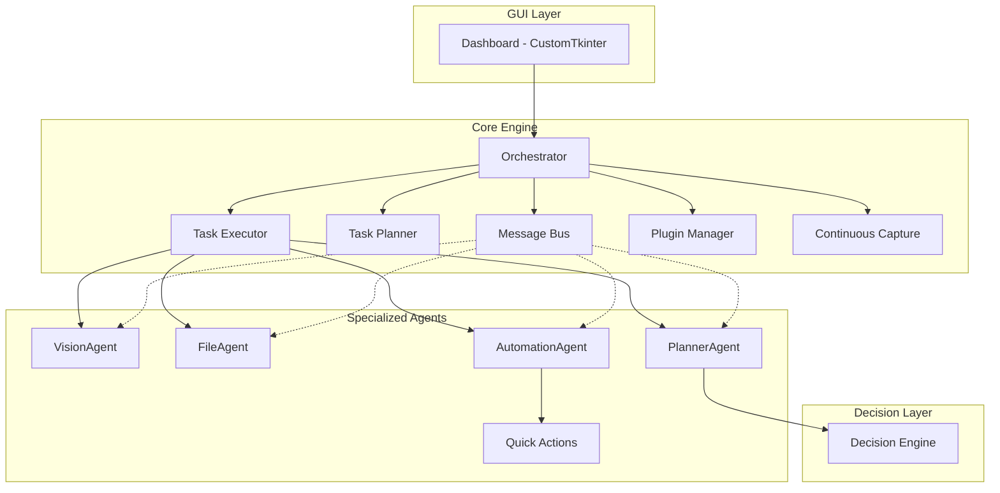

# ⚡ ShadowForge v2.1

**A fully local, offline Multi-Agent Desktop Automation System**

**Author:** [Shrinjoy Ghosh](https://github.com/Gitersg) · **Repository:** [github.com/Gitersg/ShadowForge](https://github.com/Gitersg/ShadowForge)  
**License:** MIT — free to use and learn from; please keep author credit if you redistribute.

ShadowForge is a modular multi-agent system that observes your desktop, scans folders, and runs reliable automations — with **zero cloud APIs and zero internet dependency** after setup.

Built for the Kaggle 5-Day AI Agents Vibe Coding Capstone.

---

## What's New in v2.1

- **Screen Monitor** — automatic interval screenshots (1 / 2 / 3 / 5 / 10 sec) while the executor runs
- **Folder Scanner** — scan any folder path (with Browse button); fresh results every time
- **Quick Actions** — reliable one-click automations (Win+D, Ctrl+S, Screenshot, Alt+Tab, and more)
- **EasyOCR + Tesseract** — dual OCR engines with Windows Tesseract auto-detection
- **Workflow context chaining** — agents pass results to each other automatically
- **MIT LICENSE + author credit** — full open-source protection

---

## Downloaded the ZIP? Start Here

1. **Extract the ZIP** — folder will be named `ShadowForge-main` or `ShadowForge`
2. **Install Python 3.10+** from [python.org](https://www.python.org/downloads/) — check **"Add Python to PATH"**
3. **Double-click `INSTALL_AND_RUN.bat`** — installs dependencies and opens the app (first run: 1–2 min)
4. **Next time**, double-click `RUN_SHADOWFORGE.bat`

> There is no `.exe` file. The app runs via Python. The `.bat` files handle everything.

**Screenshots save to:** `data/screenshots/` inside your project folder (created automatically).

See **`START_HERE.txt`** for quick steps or **`USER_MANUAL.md`** for the full professional guide.

---

## Core Features (v2.1)

### 📸 Screen Monitor
Set an interval (1–10 seconds) and capture screenshots automatically while you work. Ideal for study sessions, documentation, and screen auditing. Stops when you stop the executor.

### 📁 Folder Scanner
Enter or browse to **any folder path**. Get a full report: file count, total size, file types, categories, largest files, and duplicate groups. Every scan is fresh — no stale cached results.

### ⚡ Quick Actions
Pick a preset action from a dropdown and run it after a 3-second countdown. No OCR required — works every time.

Available actions: Show Desktop, Open Run, Open Explorer, Screenshot Now, Ctrl+S, Copy+Paste, Alt+Tab, F5, Select All, Type Custom Text, Custom Hotkey.

### 🤖 Multi-Agent System
Vision, File, Automation, and Planner agents coordinated by an Orchestrator with message bus, task planner, executor, and plugin support.

---

## Features

- **Multi-Agent Architecture** — specialized agents with inter-agent messaging
- **Screen Monitor** — continuous interval capture
- **Folder Scanner** — deep directory analysis and duplicate detection
- **Quick Actions** — reliable keyboard and system automations
- **Screen Audit** — one-shot capture, OCR, UI element detection
- **Rule-Based Intelligence** — keyword-scoring decision engine (no LLM)
- **Plugin System** — extend with custom agents
- **CustomTkinter Dashboard** — dark-mode GUI with live monitoring
- **CLI Mode** — headless workflow execution
- **Full Audit Trail** — logging and persistent action history
- **100% Offline** — no data leaves your computer

---

## Architecture



### Agent Responsibilities

| Agent | Role |
|-------|------|
| **VisionAgent** | Screen capture, interval monitor, OCR, UI detection |
| **FileAgent** | Folder scanning, analysis, duplicate detection |
| **AutomationAgent** | Mouse, keyboard, hotkeys, Quick Actions |
| **PlannerAgent** | Goal analysis, workflow selection, task routing |
| **Orchestrator** | Registers agents, manages queue, coordinates execution |

---

## Project Structure

```
ShadowForge/
├── main.py                     # Application entry point
├── config.json                 # Configuration
├── requirements.txt            # Dependencies
├── LICENSE                     # MIT License
├── README.md
├── USER_MANUAL.md              # Full user guide
├── START_HERE.txt              # Quick start for ZIP downloads
├── INSTALL_AND_RUN.bat         # First-time Windows setup + launch
├── RUN_SHADOWFORGE.bat         # Quick launch (Windows)
├── shadowforge/
│   ├── config.py
│   ├── core/
│   │   ├── base_agent.py
│   │   ├── message_bus.py
│   │   ├── task_planner.py
│   │   ├── task_executor.py
│   │   ├── orchestrator.py
│   │   ├── plugin_manager.py
│   │   └── continuous_capture.py
│   ├── agents/
│   │   ├── vision_agent.py
│   │   ├── file_agent.py
│   │   ├── automation_agent.py
│   │   ├── planner_agent.py
│   │   └── quick_actions.py
│   ├── ml/
│   │   └── decision_engine.py
│   ├── gui/
│   │   └── dashboard.py
│   └── utils/
│       ├── logger.py
│       ├── history.py
│       └── ocr_engine.py
├── plugins/
│   └── example_agent.py
├── examples/
│   └── example_usage.py
├── logs/                       # Runtime logs
└── data/
    ├── screenshots/            # All captured images
    └── history.json            # Action history
```

---

## Quick Start

### Prerequisites

- Python 3.10+
- Windows 10+ (primary platform)
- [Tesseract OCR](https://github.com/tesseract-ocr/tesseract) (optional — improves text reading; Screen Monitor works without it)

### Installation

```bash
cd ShadowForge
python -m venv venv

# Windows
venv\Scripts\activate

# macOS/Linux
source venv/bin/activate

pip install -r requirements.txt
```

### Run the GUI

```bash
python main.py
```

**In the dashboard:**
1. Click **▶ Start Executor**
2. Use **Screen Monitor**, **Folder Scanner**, or **Quick Actions**

### Run CLI Mode

```bash
python main.py --cli --workflow folder_scanner
python main.py --cli --workflow screen_audit
python main.py --cli --workflow cleanup_downloads
```

### Run Examples

```bash
python examples/example_usage.py
```

---

## Built-in Workflows

| Workflow | Description |
|----------|-------------|
| `folder_scanner` | Scan any folder → analyze → find duplicates (**primary scanner**) |
| `screen_audit` | Capture screen → OCR → detect UI elements |
| `cleanup_downloads` | Scan Downloads → analyze → find duplicates |
| `organize_desktop` | Scan Desktop → analyze → find duplicates |
| `device_scanner` | Alias for `folder_scanner` |

**GUI tools (not CLI workflows):**
- **Screen Monitor** — continuous interval capture (dashboard panel)
- **Quick Actions** — preset automations (dashboard panel)

---

## Creating a New Agent (Plugin)

For developers who want to extend ShadowForge:

1. Copy `plugins/example_agent.py` to `plugins/my_agent.py`
2. Subclass `BaseAgent` and implement `process()`
3. Restart ShadowForge — your agent is auto-discovered

```python
from shadowforge.core.base_agent import BaseAgent
from shadowforge.core.message_bus import MessageBus

class MyAgent(BaseAgent):
    def __init__(self, message_bus: MessageBus, name: str = "my_agent"):
        super().__init__(name=name, message_bus=message_bus, capabilities=["my_action"])

    def process(self, task: dict) -> dict:
        action = task["action"]
        params = task["params"]
        return {"success": True, "result": "done"}
```

---

## Configuration

Edit `config.json` in the project root:

| Setting | Description |
|---------|-------------|
| `agents.vision.screenshot_dir` | Where screenshots are saved |
| `agents.automation.pause_between_actions` | Delay between UI actions (seconds) |
| `agents.automation.failsafe` | Move mouse to corner to abort automation |
| `gui.theme` | `dark` or `light` |
| `logging.level` | `INFO`, `DEBUG`, or `WARNING` |

**Environment variable overrides:**

```bash
SF_LOG_LEVEL=DEBUG
SF_THEME=dark
```

Restart the app after changing config.

---

## Building an Executable (.exe)

```bash
pip install pyinstaller

pyinstaller --name ShadowForge ^
    --onefile ^
    --windowed ^
    --add-data "config.json;." ^
    --hidden-import customtkinter ^
    --hidden-import PIL ^
    --hidden-import cv2 ^
    --hidden-import pyautogui ^
    main.py
```

Output: `dist/ShadowForge.exe`

---

## Git & GitHub (For Developers)

> **Note:** If you downloaded or cloned this repo, you do **not** need these commands. Use `INSTALL_AND_RUN.bat` or `python main.py` instead. These steps are only for publishing your own fork or copy.

```bash
git clone https://github.com/Gitersg/ShadowForge.git
cd ShadowForge

# Make your changes, then:
git add .
git commit -m "Your commit message"
git push
```

**First-time publish (new repository only):**

```bash
git init
git add .
git commit -m "Initial commit: ShadowForge multi-agent desktop automation"
git remote add origin https://github.com/YOUR_USERNAME/ShadowForge.git
git branch -M main
git push -u origin main
```

---

## Roadmap

- [x] Interval screen monitor (Screen Monitor)
- [x] Folder scanner with duplicate detection
- [x] Quick Actions panel
- [x] EasyOCR + Tesseract dual OCR
- [x] MIT License and author protection
- [ ] Agent memory across sessions
- [ ] Visual workflow builder in GUI
- [ ] Scheduled background tasks
- [ ] Multi-monitor support
- [ ] Windows notification integration
- [ ] Offline voice commands (local Whisper)
- [ ] Agent performance metrics dashboard

---

## Author & Support

**Built by Shrinjoy Ghosh ([@Gitersg](https://github.com/Gitersg))** — Kolkata, India · 2026  
Built for the Kaggle 5-Day AI Agents Vibe Coding Capstone.

If ShadowForge helps you, a ⭐ star on GitHub means a lot.

---

## License

This project is licensed under the **MIT License** — see [LICENSE](LICENSE) for full text.

You may use, modify, and share ShadowForge freely. If you redistribute it, keep the copyright notice and license.

---

<p align="center">
  <strong>ShadowForge v2.1</strong> — Your desktop. Your agents. Your rules. Fully offline.<br>
  © 2026 Shrinjoy Ghosh
</p>